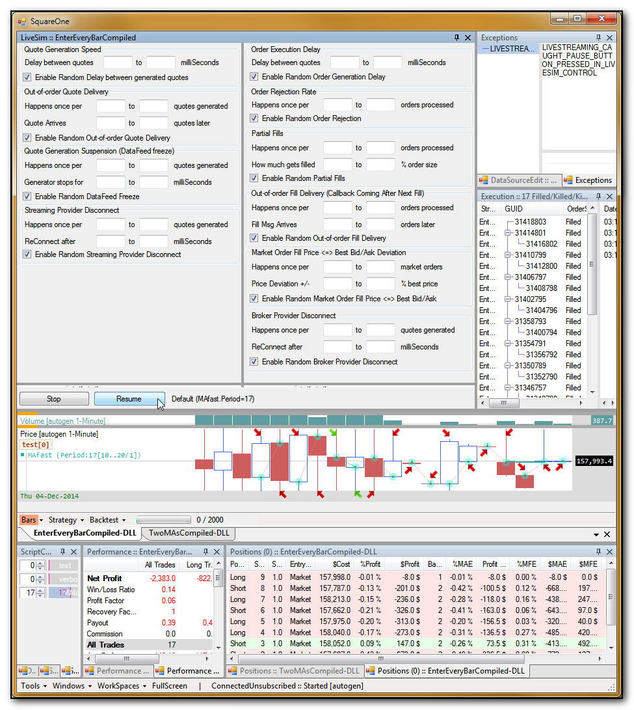
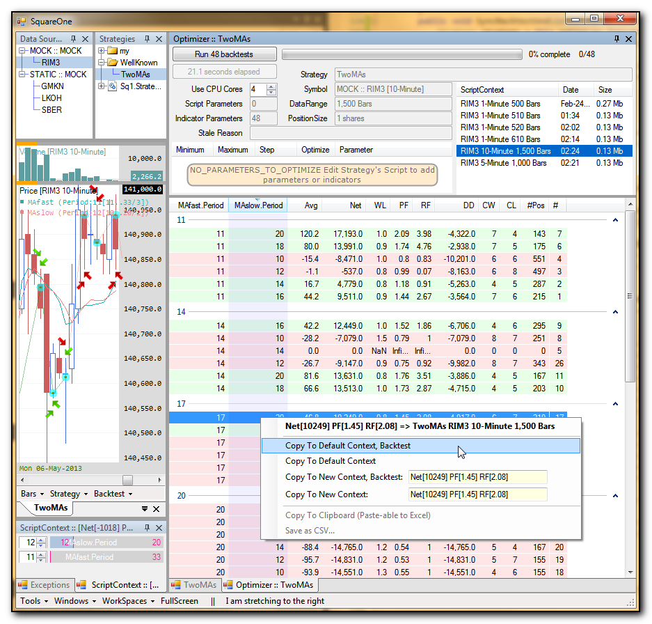
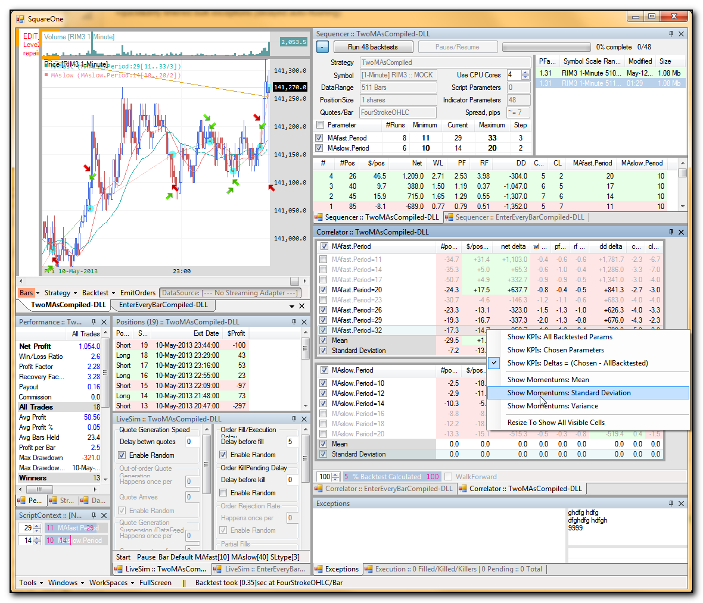

SquareOne v1.0-dev branch
=========================

Already implemented in v1.0-dev (this branch, to be released ~Jan2015 **)
-------------------------------------------------------------------------

* strategy optimizer
* add indicators (SMA, ATR)
* add indicators' parameters into ScriptParameters pane
* let Script draw vertical & horizontal lines on PanelPrice
* let Script set bars' fore&background colors on PanelPrice
* SpreadModelerPercentageOfPrice + controls in ChartForm
* Quik streaming & broker adapters
* ChartForm add controls for SpreadModelerPercentageOfPrice
* put streamingProvider-delivered quote into inboundQueue and return immediately  (disconnect streaming and strategy execution using quote buffer); let the streaming do its business in thread#1 while Distributor will push quotes/bars received in thread#2 (smth like ConcurrentQueue implementing IObservable in in its own thread) //for myself
* strategy optimizer consumes 45,000 handles after 56 backtests
* optimizer results: heat map on top of ObjectListView's grouping / sorting 
* add SymbolInfo editor

TODO list for v1.0-dev (this branch, to be released ~Jan2015 **)
----------------------------------------------------------------

* TRADE LIVE on Quik demo account
* refactor order processing for a cleaner lifecycle

TODO list for v2.0-dev (next release after this one, ~Jun2015 **)
-----------------------------------------------------------------

* simulate & test OrderPostProcessor* activation
* WinForms port to MONO (drop P/Invoke from ObjectListView and DockPanelSuite)
* streaming/realtime access to another instrument's Bars within userland strategy code, at least within the same DataSource (after which it wouldn't be difficult to subscribe the strategy to any other Symbol across all StreamingProviders / exchanges; inter-exchange order execution/accounting will be the next big task) //for Alex,calendarSpread
* add support for options (storing all the strikes in multiple *.BAR files or one combined format, import of multiple strikes into one Symbol, extending streaming/execution API with strike selection) with QUIK as guinea pig //for Rami,options
* charting for multi-Symbol strategies (bravo ProTrader3, your overlay normalization is almost arbitrage model calibration) //for Alex,calendarSpread
* move QuikMockStreaming to Core and merge with MarketSimStreaming (both were prototypes of market-side model poking the  StreamingProvider chosen in DataSource), provide Editor to let user choose what DataFeed will generate (quotes along original Bars or sine-wave bars, next quote delay, delay randomness, jump distance&randomness, seconds of missing data, # of stale quotes etc) //for myself,lighterAdaptersHeavierCore
* move QuikMockBroker to Core and merge/split with MarketSimStreaming (it was as a prototype of market-side model invoking callBacks of the BrokerProvider chosen in DataSource), provide Editor to let user choose how Order Execution will behave (randomness while rejecting orders, disconnect/connect, missing fills, partial fills, late fill notifications etc) //for myself,lighterAdaptersHeavierCore
* Interactive Brokers adapter (StreamingProvider & BrokerProvider) //for Eduardo,realtime
* very basic Python/R integration; wrapper strategy instantiating Python runtime and invoking PyScript's methods (watch imported libraries and inner exceptions...) //for Eric,Harry

"**" - time estimates are mentioned for me alone working on the project; you can bring the date closer to tomorrow if you help me with any development task; feel free to fork the repository and implement your own improvements if you want to use those trading features on your desktop as soon as possible; create an issue on github, describe what you are implementing and how, and assign it to yourself to indicate "you have taken upon the chosen feature"

Notes
-----

* SquareOne is covered by GPLv3; do you agree with its terms? (free to use, open source, distribution of derived work with published source code, no warranty etc)
* please make your derived project also opensource if you use any part of SquareOne source code (platform enhancements), or please do not distribute at all (your proprietary trading strategies and other KNOW-HOW)