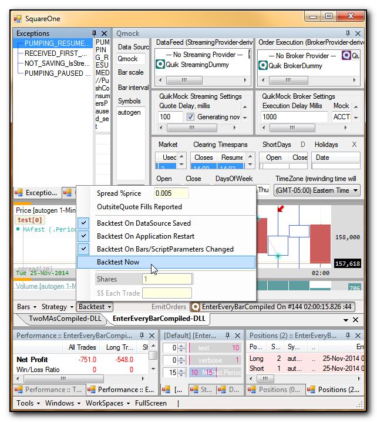

SquareOne v1.0-devQuik branch
=========================

Already implemented in v1.0-dev (this branch, to be released ~Jan2015)
-------------------------------------------------------------------------

* QuikMock Streaming, generating sine-wave quotes
* Sort of BrokerProvider (2b reviewed)

TODO list for v1.0-devQuik (this branch, to be released ~Jan2015 **)
----------------------------------------------------------------

* Refactor DdeChannels
* Automatic QUIK DDE-exported table recognition & instructions how to fix it through Exceptions
* fully simulated QUIK using *Mock